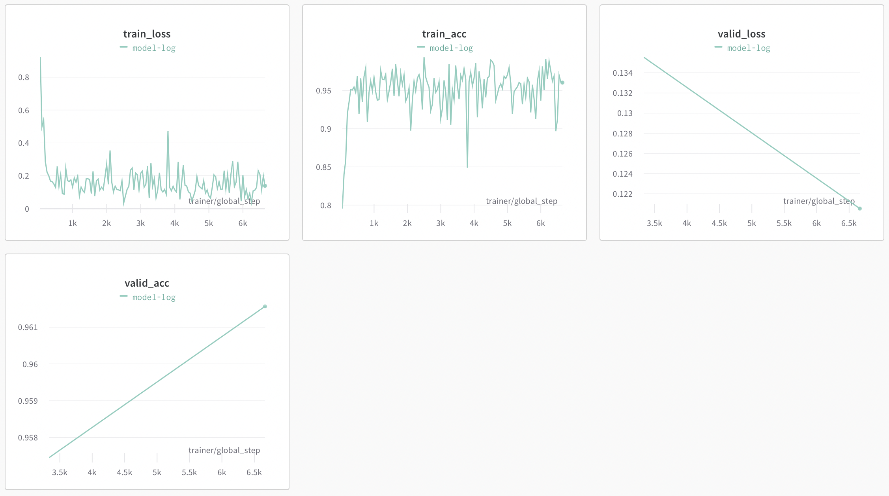

# Entity Extraction

### Overview

This repository contains code for Named-Entity-Extraction (NER) using finetuned RoBERTa models. The dataset has been borrowed from [Kaggle](https://www.kaggle.com/datasets/namanj27/ner-dataset). Below is the header of how the input dataset looks.

|Sentence # |Word         |POS|Tag  |
|-----------|-------------|---|-----|
|Sentence: 1|Thousands    |NNS|O    |
|           |of           |IN |O    |
|           |demonstrators|NNS|O    |
|           |have         |VBP|O    |
|           |marched      |VBN|O    |
|           |through      |IN |O    |
|           |London       |NNP|B-geo|
|           |to           |TO |O    |

### Code Structure

```
├── data                        # DATA FILES
│   ├── data.csv                    # Raw Dataset from Kaggle 
│   ├── train.csv                   # Training split from data.csv
│   └── valid.csv                   # Validation split from data.csv
│   ├── mapping.json                # Mapping of labels to index
│   ├── score.csv                   # Model scores on valid.csv
│   ├── model                       # Finetuned Model
│   │   └── model.pt-v1.ckpt
│   ├── report.txt                  # Evaluation Report on valid.csv

├── source                      # SOURCE CODE
│   ├── data.py                     # Data Loaders
│   ├── model.py                    # HuggingFace Model
│   ├── score.py                    # Scoring Model
│   └── train.py                    # Training Model

├── main.py                     
├── conf.yaml                   # CONFIG File

```

### Instructions

- Download the "data.csv" file from Kaggle and place it in data folder. 

- Command to split to preprocess data file and split it into training, validation

```shell
python main.py --mode prepare-data
```

- Command to finetune the model

```shell
python main.py --mode train-model
```

- Command to evaluate the model
```shell
python main.py --mode score-model
```


### Performance

The final model performance is saved in report.txt file. It looks like:

|label |precision| recall |f1-score|support|
|------|---------|--------|--------|------ |
|art          |0.38  |0.06    |0.10   |161    |      
|eve          |0.22  |0.23    |0.23   |61     |      
|geo          |0.86  |0.88    |0.87   |12744  |      
|gpe          |0.94  |0.95    |0.95   |5020   |      
|nat          |0.35  |0.44    |0.39   |73     |      
|org          |0.70  |0.70    |0.70   |6655   |      
|per          |0.76  |0.81    |0.78   |5195   |      
|tim          |0.83  |0.82    |0.82   |3942   |
|             |      |        |       |       |
|micro avg    |0.82  |0.83    |0.82   |33851  |
|macro avg    |0.63    |0.61   |0.60  |33851  |
|weighted avg |0.82  |0.83    |0.82   |33851  |  

The wandb logs are below:




